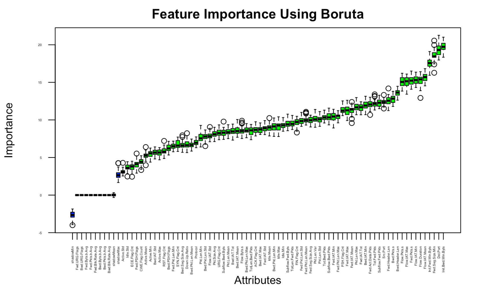
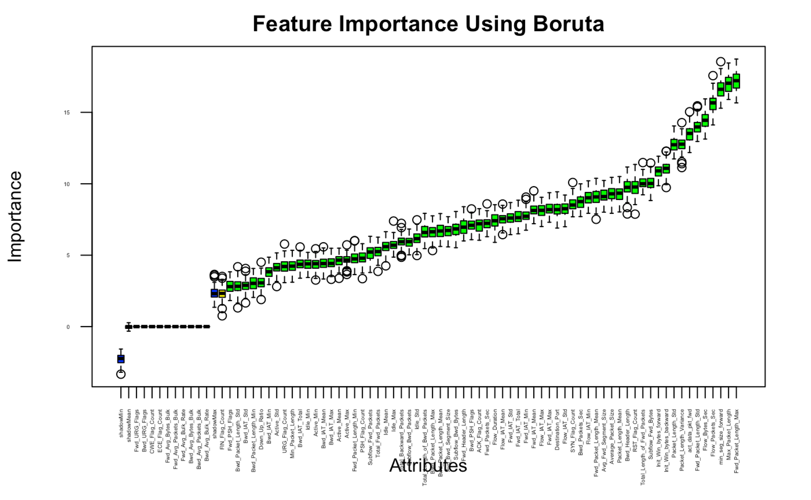

```{r setup, include=FALSE}
knitr::opts_chunk$set(echo = FALSE, message=FALSE, warning=FALSE)
```

```{r libraries, include=FALSE}
library(Boruta)
library(mlbench)
library(caret)
library(randomForest)
library(ggplot2)
library(corrgram)
library(e1071)
library(class)
library(kableExtra)
library(dplyr)
library(rpart)
library(rpart.plot)
```

```{r setup-2, include=FALSE}
## reset color defaults
## Source https://data-se.netlify.com/2018/12/12/changing-the-default-color-scheme-in-ggplot2/
library(viridis)
library(scales)

#### continuous variables color and fill
options(ggplot2.continuous.colour = "viridis")
options(ggplot2.continuous.fill = "viridis")

#### use viridis for discrete scales
scale_colour_discrete <- scale_colour_viridis_d
scale_fill_discrete <- scale_colour_viridis_d

## reset default theme
##theme_set(theme_minimal())
```


```{r data-load-1, include=FALSE}
set.seed(333)
# Visualize first couple of rows

ddos_data <- read.csv("./data/ddos_balanced_sample.csv")

train_index <- sample(1:nrow(ddos_data), 0.5 * nrow(ddos_data))
test_index <- setdiff(1:nrow(ddos_data), train_index)

# Build X_train, y_train, X_test, y_test
train <- ddos_data[train_index,]

test <- ddos_data[test_index,]

train <- select(train, -c(X, Flow.ID, Src.IP, Dst.IP, Timestamp))
test <- select(test, -c(X, Flow.ID, Src.IP, Dst.IP, Timestamp))
train <- tibble(train)
train <- data.frame(train)
test <- tibble(test)
test <- data.frame(test)
# train
# apply(train, 2, function(x) any(is.na(x)) || any(is.infinite(x)))
# train$Flow.Byts.s
train$Flow.Byts.s[which(!is.finite(train$Flow.Byts.s))] <- 0
train$Flow.Pkts.s[which(!is.finite(train$Flow.Pkts.s))] <- 0
test$Flow.Byts.s[which(!is.finite(test$Flow.Byts.s))] <- 0
test$Flow.Pkts.s[which(!is.finite(test$Flow.Pkts.s))] <- 0
# train$Flow.Byts.s

training_pre <- head(train)
```

```{r data-load-2, include=FALSE}
# Visualize first couple of rows
train_data <- read.csv("./data/train_sample.csv")
train_pre <- head(train_data)

test_data <- read.csv("./data/test_sample.csv")
test_pre <- head(test_data)
```

#Introduction

My paper attempts to answer three main questions. Using an Intrusion Detection System (IDS) to monitor network traffic, what aspects of the network traffic indicate signs of a DDoS attack? Using an IDS, can we consistently and accurately detect a DDoS attack? If so, what statistical learning model can most reliably detect DDoS traffic? Before I describe my analysis, first I want to explain a little bit about a DDoS attack and why I decided to choose this topic.

A distributed denial-of-service (DDoS) attack is a malicious attempt to disrupt normal traffic of a server or network by flooding the infrastructure with internet traffic. The reason DDoS attacks are so effective is unlike a normal denial-of-service (DoS) attack it utilizes multiple compromised networks as sources of internet traffic in order to take down the specific server. The typical way this is done is by spreading a virus to many different computers to form a botnet that can allow these computers to be instructed remotely to send traffic to the attacked server. The most common way to overwhelm a server is to provide as much bandwidth as possible to the specific machine until it cannot properly respond to any other HTTP requests. A reason that web servers are vulnerable to this attack is that a HTTP request is very cheap to execute on the client side, however, can be expensive for the server to respond as often the server will have to retrieve information from a database or load multiple files. Although it is often difficult for hackers to take down big companies such as google or amazon with DoS attacks. With a big enough botnet, it is getting more common for hackers to even be able to take down even website able to handle large amounts of bandwidth. For example, in 2012 hackers targeted six major US banks including Bank of America and JP Morgan Chase and over three days were able disrupt services and slow down the bank’s services. DDoS attacks can be very costly for small, medium, and even large companies if their website is critical to their business. This is why it is very important to be able to detect and block traffic from the computers that are involved in a DDoS attack. In 2018 GitHub was hit with the largest DDoS attack to date with a record breaking 1.3 terabits per second. However, since they were using a DDoS protection service, they were able to contain and stop the attack within 10 minutes.

In order to understand my project, it is important to understand the idea of an Intrusion Detection System (IDS). An IDS monitors network traffic to look for suspicious activity or threats. In this instance we will be using data from IDS’s that have been specifically subject to DDoS attacks to gain insights on DDoS attacks and how they appear on an IDS.

After analyzing data from both datasets, I have been able to find out both what aspects of data characterize DDoS traffic and how to accurately model this data. I have been able to pinpoint three specific features in the data that are the most important for DDoS classification. Additionally, I have been able to classify DDoS data with a ~99.71% accuracy and figure out the best approach to classification for this data. When using an IDS there are three key features that characterize DDoS traffic, minimum segment size in the forward direction, flow duration/speed, and initial window bytes/packets per second. Additionally, since the data is not linearly separable a tree-based classification model is the best detection approach because it provides accurate and interpretable results.

#Methods

I used two different datasets in my analysis to ensure that my findings were applicable for multiple types of DDoS attacks. The first dataset that I used was a dataset that I found on Kaggle. It had data from an IDS that used two different types of Application-Layer DDoS attacks, DDoS Hulk and DDoS Slowloris. The IDS contained 77 features for analysis and in total the dataset had ~800,000 datapoints with a mixture of Benign, DDoS Slowloris, and DDoS hulk data. The second dataset I used was extracted from the Canadian Institute for Cybersecurity (CIC) IDS DDoS datasets from 2016, 2017, and 2018. This IDS had 84 features and 12.7 million datapoints. The labels only differentiated between benign and DDoS traffic, however there were many different types of DDoS attacks used in the data.

**Kaggle Dataset**

```{r show-data}
kable(train_pre) %>%
  kable_styling(bootstrap_options = c("striped", "hover", "responsive"), full_width = F) %>%
  scroll_box(width = "100%", height = "250px")
```

**CIC Dataset**

```{r show-data2}
kable(training_pre) %>%
  kable_styling(bootstrap_options = c("striped", "hover", "responsive"), full_width = F) %>%
  scroll_box(width = "100%", height = "250px")
```

Since both datasets had a significant amount of datapoints it was important to use a subset of the data to improve the speed of modeling. In order to find a random subset of the data in both datasets I used the command line tool shuf which quickly generated new file holding a random subset of data. Next, I had to remove four features from the CIC dataset, timestamp, flow ID, source IP address, and destination IP address. Although, this data might be interesting to look at, they simply did not apply to my model. The timestamp did not accurately reflect the typical times in which a DDoS attack would occur because the DDoS attacks were simulated. Additionally, the IP addresses of the attacking machines were specific to the network that the IDS was run on therefore would hold no relevance in actual DDoS detection. Next, I scanned the data for any infinite or N/A data and found infinite data for the Flow bytes per second and the flow packets per second. I decided to set the datapoints with infinite values to zero because there were so few that it would not provide a statistically significant difference in my analysis. Finally, since I was going to be using a validation set approach when modeling the data, I split my data into two datasets one for testing and one for training. Since I had an abundance of data, I simply used half for testing and half for training.

Since the data I used had many features to analyze it was critical to use feature importance algorithms to identify which features are most important in classification models. Feature analysis provided me with a starting point for my data analysis and was ultimately a fundamental part of identifying features that characterize DDoS attacks in an IDS. First, I used the Boruta algorithm on both datasets. The Boruta algorithm duplicates and shuffles the dataset then trains a random forest classifier on the data. Then it compares the importance of each feature with the shadow features in the duplicated dataset and repeats these many times to find which features are the most important in the dataset. From the results I found that there three features that tended to be the most important across both datasets. These were minimum segment size in the forward direction, initial window bytes/packets per second, and flow duration/speed. 

**CIC Dataset**



**Kaggle Dataset**



Although the Boruta algorithm provides a great deal of information on the data I wanted to find out specifically how DDoS and benign traffic differed. Additionally, there were many features that were important in one dataset but not the other, so I wanted to analyze those as well. So, in order to learn more, I wanted to find out the distribution patterns of the data and also find how different the data is. To do so, I decided to create density plots and two sample t-tests of the Boruta algorithm’s top fifteen most important features from each dataset. Although an anova test would work to determine if there was a statistically significant difference in the means between all the features, I was not particularly interested in this information. I decided to do individual two sample t-tests to find out if individual features had a statistically significant difference in means which allow me to look at the data more specifically.

After visualizing the data, I had a good idea of what features were important. However, to find out more, I applied various statistical models to the data. I tried to analyze which model did well and which did not and why. Additionally, for many of the models I used variable importance to track which features caused the model to be the most accurate. The models that I used were K nearest neighbors, Naïve Bayes, logistic regression, Decision Tree, Support Vector Machine, and random forest. 

#Results

###Minimum Segment Size in the Forward Direction

From initially using the Boruta algorithm I was able to identify patterns of specific features that were most important. From the density plots I was able to look much closer at the data and find the differences in distribution from the data. Then using two sample t-tests I was able to quantify how different the means were of the key variables. The first important takeaway is how important the minimum segment size in the forward direction is. From a density plot and boxplot, we can see how drastically different the distribution is between DDoS and Benign traffic. To understand this insight, we first must understand what the segment size is. A segment refers to a protocol data unit (PDU) of the Transmission Control Protocol (TCP). A PDU is just a single unit of information transmitted among entities of a computer network. A TCP segment contains a segment header and a data section. The segment size is actually not the size of the whole segment but actually just the data section. A segment size of zero means that this section of the packet essentially has no data. From our data visualization we can see that it is very rare for benign traffic to have a minimum segment size of zero, however, in almost every case DDoS data has a minimum segment size of zero. However, when we look at average segment size, we see no such trends. Actually, the average segment size of DDoS data is on average higher. Additionally, the packet length of DDoS data is higher on average as well. This demonstrates that while DDoS data doesn’t differ as significantly in average segment size due to the large packets that DDoS data tends to send, DDoS traffic frequently sends completely blank and useless segments that are very rare in benign traffic. While this may be used to counteract the average segment size or maybe could be just laziness on the end of hackers, this is a very detectable flaw. Due to the tremendous difference in means between DDoS and benign data we can see that we can easily detect DDoS data by monitoring for very low segment sizes.

```{r}
library(plyr)
mu <- ddply(train, "Label", summarise, mean=mean(Fwd.Seg.Size.Min))

kable(mu) %>%
  kable_styling(bootstrap_options = c("striped", "hover"))

ggplot(train, aes(x=Fwd.Seg.Size.Min, color = Label)) +
  geom_density() +
  geom_vline(data=mu, aes(xintercept=mean, color=Label),
             linetype="dashed") +
  labs(title = "Density Plot of Minimum Forward Segment Size", x = "Forward Minimum Segment Size")

mu <- ddply(train, "Label", summarise, mean=mean(Fwd.Seg.Size.Avg))

kable(mu) %>%
  kable_styling(bootstrap_options = c("striped", "hover"))

ggplot(train, aes(x=Fwd.Seg.Size.Avg, color = Label)) +
  geom_density() +
  geom_vline(data=mu, aes(xintercept=mean, color=Label),
             linetype="dashed") +
  labs(title = "Density Plot of Average Forward Segment Size", x = "Forward Average Segment Size")
```

**T-test of the Minimum Segment Size in the Forward Direction**

```{r min-seg-t-test}
t.test(Fwd.Seg.Size.Min ~ Label, data = train)
```

###Initial Window

Another interesting takeaway is that the initial window bytes/packets are very effective in detecting DDoS traffic in both datasets. The initial window is how the TCP sender tests the network capacity of the server and avoids congesting the network. TCP employs a slow start during which TCP exponentially increases the congestion window. The time between when the TCP sender starts and then exponentially increases is the initial window. Since DDoS traffic has no regard for congesting the network, it sends a different signal and interestingly enough the initial window bytes/packets in the backwards direction are more important for classification. What is interesting about this data is that there is almost no difference in the mean between DDoS and benign traffic. When doing a two-sample t-test to determine if their means are the same got a p-value of ~0.9. However, they are so important because they have significant difference in distribution. The distribution of benign traffic clusters around 0 and 61,000, however, the distribution of DDoS traffic clusters around 0 and 31,000. This can demonstrate why certain classification models will perform better. Tree based models can use the difference in the clustering of data to its advantage but, a model such as Naïve Bayes might not do as well.

```{r}
mu <- ddply(train, "Label", summarise, mean=mean(Init.Bwd.Win.Byts))

kable(mu) %>%
  kable_styling(bootstrap_options = c("striped", "hover"))

head(mu)

ggplot(train, aes(x=Init.Bwd.Win.Byts, color = Label)) +
  geom_histogram(fill="white", position="dodge")+
  geom_vline(data=mu, aes(xintercept=mean, color=Label),
             linetype="dashed") +
  labs(title = "Histogram of Initial Window Backward Bytes Between DDoS and Benign", x = "Initial Window Backward Bytes")

mu <- ddply(train, "Label", summarise, mean=mean(Init.Fwd.Win.Byts))

kable(mu) %>%
  kable_styling(bootstrap_options = c("striped", "hover"))

ggplot(train, aes(x=Init.Fwd.Win.Byts, color = Label)) +
  geom_vline(data=mu, aes(xintercept=mean, color=Label),
             linetype="dashed") +
  geom_density() +
  labs(title = "Density of Initial Window Forward Bytes Between DDoS and Benign", x = "Initial Window Forward Bytes")
```

**T-test of the Initial Window Bytes in the Backward Direction**

```{r bwd-win-bytes}
set.seed(222)
t.test(Init.Bwd.Win.Byts ~ Label, data = train)
```

**T-test of the Initial Window Bytes in the Forward Direction**

```{r fwd-win-bytes}
t.test(Init.Fwd.Win.Byts ~ Label, data = train)
```

### Flow Duration

The third main insight was about how flow duration and speed were important to detecting DDoS traffic. A packet or network flow is a sequence of packets from a source computer to a destination. It consists of all packets in a specific transport connection or a media stream. Each datapoint consists of many individual flows, therefore, the IDS can track both the time between flows and the flow duration. Both the average time between flows and flow duration show a significant difference between the means of DDoS and benign traffic with the two-sample t-tests having p-values of 6.169x10^-9 and 2.2x10^-16 respectively. In both cases benign traffic tends to have a higher mean. Demonstrating that typical web users tend to spend much longer amounts of time on websites, but the server also tends to have more gaps between users when experiencing normal traffic. However, when dealing with a DDoS attack there is a very small amount of time between flow and they tend to have shorter connections. This is a particularly important insight because this is something that is innate about DDoS attacks. With better technology and smarter hackers, they could fix the minimum segment size issue, but due to the fact that DDoS attacks rely on speed it would be difficult to form an attack with flow data that mimics typical users. This insight provides a consistent and accurate detection mechanism.

```{r flow-viz}
set.seed(333)
mu <- ddply(train, "Label", summarise, mean=mean(Flow.IAT.Mean))

kable(mu) %>%
  kable_styling(bootstrap_options = c("striped", "hover"))

ggplot(train, aes(x=Flow.IAT.Mean, color = Label)) +
  geom_histogram(fill="white", position="dodge")+
  geom_vline(data=mu, aes(xintercept=mean, color=Label),
             linetype="dashed") +
  labs(title = "Histogram of the Average Time Between Flows", x = "Average Time Between Flows")

mu <- ddply(train, "Label", summarise, mean=mean(Flow.Duration))

kable(mu) %>%
  kable_styling(bootstrap_options = c("striped", "hover"))

ggplot(train, aes(x=Flow.Duration, color = Label)) +
  geom_vline(data=mu, aes(xintercept=mean, color=Label),
             linetype="dashed") +
  geom_density() +
  labs(title = "Density Plot of the Flow Duration", x = "Flow Duration")
```

**T-test of the Average Time Between Flows**

```{r iat_t}
t.test(Flow.IAT.Mean ~ Label, data = train)
```

**T-test of the Flow Duration**

```{r fl-dur-t}
t.test(Flow.Duration ~ Label, data = train)
```

### Classifiers

Finally, we can take a look at the findings from our model test accuracy to find out which statistical model performed the best. Additionally, we can use variable importance and visualize our tree-based model to find more about the data. From the test accuracy we can see that the support vector machine and Naïve Bayes classification models performed the worst. One reason for the poor performance of the support vector machine is that the model makes the assumption of a linear decision boundary. However, this data clearly does not have a linear decision boundary. A reason why Naïve Bayes might perform poorly is that it assumes the features are conditionally independent. However, this is often not the case with a large dataset such as this. A clear takeaway from the modelling is that tree-based models perform very well with this data. A couple reasons may be that it can classify data that is not linearly separable well and can handle data that is not normally distributed. An additional benefit of tree-based models is that they are very interpretable and can easily converted into a runtime classifier by using the groupings used in the decision tree or random forest to flag specific traffic that might be DDoS.

**K Nearest Neighbors**

```{r knn}
set.seed(333)
X_train = subset(train, select = -c(Label))
X_test = subset(test, select = -c(Label))

knn_all <- knn(X_train,X_test,cl=train$Label,k=10)
confusionMatrix(knn_all, test$Label)
```

**Naive Bayes**

```{r}
set.seed(333)
nb_all <- naiveBayes(Label ~ ., data = train)
p_nb <- predict(nb_all, test)
confusionMatrix(p_nb, test$Label)
```

**Support Vector Machine**

```{r svm}
set.seed(333)
classifier = svm(Label ~ ., data = train)
p<-predict(classifier,test,type="response")
confusionMatrix(p, test$Label)
```

**Decision Tree**

```{r decision-tree}
set.seed(333)
# Create a decision tree model
tree.model2 <- rpart(Label~., data=train)

tree2.pred <- predict(tree.model2, test)

maxidx <- function(arr) {
    return(which(arr == max(arr)))
}
idx <- apply(tree2.pred, c(1), maxidx)
tree.prediction2 <- factor(c('Benign', 'ddos')[idx])

confusionMatrix(tree.prediction2, test$Label)

tree.imp <- varImp(tree.model2)
tree.imp <- data.frame(overall = tree.imp$Overall,
           names   = rownames(tree.imp))
tree.imp <- tree.imp %>% arrange(desc(overall))

tree.imp <- select(tree.imp, -c(overall))

names(tree.imp)[1] <- "Six Most Important Features"
```

**Decision Tree Visualized**

```{r decision-tree-visualized}
# Visualize the decision tree with rpart.plot
rpart.plot(tree.model2, box.palette="RdBu", shadow.col="gray", nn=TRUE)
```

**Decision Tree Variable Importance**

```{r decision-tree-var-imp}
kable(head(tree.imp)) %>%
  kable_styling(bootstrap_options = c("striped", "hover"))
```

**Random Forest**

```{r random-forest}
set.seed(333)
rf_all <- randomForest(Label ~ ., data = train)

p <- predict(rf_all, test)
confusionMatrix(p, test$Label)
```

**Logistic Regression**

```{r logistic-regression}
blm.fit <- glm(Label~., data = train, family = "binomial")
p<-predict(blm.fit,test,type="response")
results <- ifelse(p > 0.5, "ddos", "Benign")
class <- factor(results)
confusionMatrix(class, test$Label)
imp <- varImp(blm.fit, scale = FALSE)
imp <- data.frame(overall = imp$Overall,
           names   = rownames(imp))
imp <- imp %>% arrange(desc(overall))

imp <- select(imp, -c(overall))

names(imp)[1] <- "Six Most Important Features"
```

**Logistic Regression Variable Importance**

```{r log-reg-var-imp}
kable(head(imp)) %>%
  kable_styling(bootstrap_options = c("striped", "hover"))
```

#Conclusion

Through an in-depth analysis of two IDS DDoS datasets we were able to find three key features of DDoS traffic that can be used for classification: minimum segment size in the forward direction, flow duration/speed, and initial window bytes/packets. These insights allowed us to understand what makes a DDoS classifier succeed and why tree-based models are a great statistical model to use for DDoS classification. Although I am very happy with my results and the accuracy of the classification models, there are two limitations that I will try and overcome in the future. The main limitation is that I was that I could not create a real time DDoS classifier because I do not have the resources to create my own IDS for real time classification. Another issue that I would like to pursue in the future is using an unbalanced dataset or exploring ways to minimize type 1 errors that falsely detect a DDoS attack. Overall, DDoS classification is a very interesting way that data science and cybersecurity come together, and I am very excited for the advancement of data driven cybersecurity.